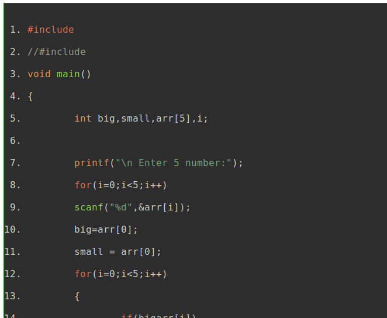
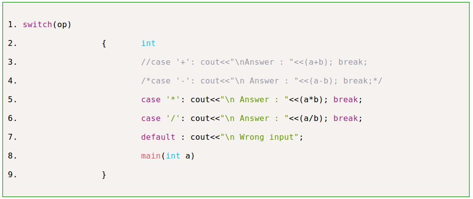

# HiliSyntax
It is a simple Syntax Highlighter tool that will highlight programming syntax in your blog or webpage.

---

## How to use ?
 You can use this tool in two ways to Highlight Syntax in your Webpage or Blog :-
1. By Adding Link Of HiliSyntax Highlighter in your Webpage or Blog.
2. By Using Our Live Syntax Highlighter Tool.
 Now Discuss Both Methods one by one :- 
 
### 1.Steps to use HiliSyntax Highlighter by Adding links:-
 
+ Add The Below link in your webpage between the head tag.
    
    ```
       <script type="text/javascript" src="https://cdn.statically.io/gh/blaregroup/HiliSyntax/master/js/HiliSyntax_Link.js" > </script>
    ```

    ```        
            eg:- <br/>
               <head > 
                  <script type="text/javascript" src="https://cdn.statically.io/gh/blaregroup/HiliSyntax/master/js/HiliSyntax_Link.js"></script>

              </head>;
     ```
 
+ Now Add your code in pre tag

     ```
      eg:- 
                 < pre >
                   //your code
                 </pre>;
     ```

+ Then add any of one class in pre tag **HiliSyntax_Light** or **HiliSyntax_Dark**
      - Use HiliSyntax_Light Class for Light Theme 
      - Use HiliSyntax_Dark  Class for Dark Theme
     
     ```
      eg:- 
             < pre class="HiliSyntax_Light">
                //your code
             </pre>
     ```       
   
  
  
    
### 2.Steps to use HiliSyntax Live Highlighter Tool :-

1. Clone This Repository and Run LiveHiliSyntax.html in browser.

2. Now in one side write your code or paste the code and on other side Highlighted code will be generated automatically.

3. Default Theme is Dark but you can choose Light Theme By clicking on Light Theme Button or you can try unlimited Theme by Clicking on Shuffle Theme button.

4. Once you are done with code or choosing right theme then click on copy code button it will copy the whole code for you and then paste it in your Webpage or Blog where ever you want to be. 
      
---           

## Preview
 
  ### Dark_Theme
  
  
  
  ### Light_Theme
  
  
 
  ### Live Editor
  
  
  

---  

## Developers/Author
- Himanshu Sharma [Email](himanshusharma2972@gmail.com)   [github/himanshu-sharma2018](https://github.com/himanshu-sharma2018)
- Slowest Wind  [Email](slowestwind@gmail.com)   [github/slowestwind](https://github.com/slowestwind)
